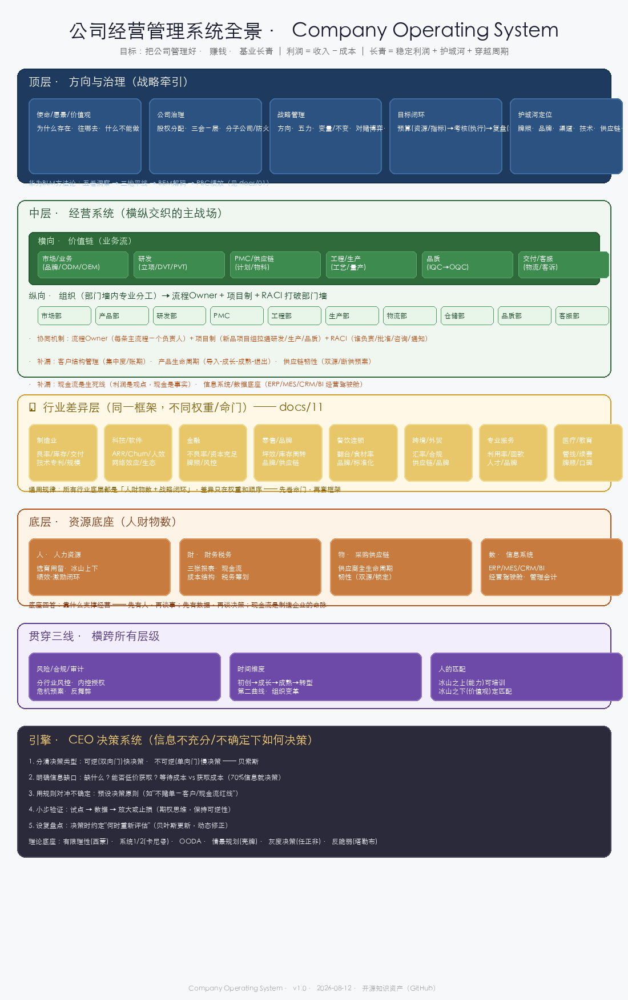

# Company Operating System: A Cross-Industry Management Playbook

> **Build a company that works — and keeps working.**
> An open-source operating model for founders, CEOs, and operators to connect strategy, governance, operations, people, cash, risk, and decision-making.

**19 chapters · 12 industry playbooks · practical checklists and templates · MIT licensed · AI-native organization chapter**

Not ERP software. Not a collection of management slogans. A reusable framework you can adapt to your company — and use alongside your ERP, project tools, and knowledge base.

> **Language note:** This English README is an overview. The source chapters are currently Chinese-first, with full English translation planned. PRs are welcome.

**中文版** 👉 [README.md](README.md)

---

## What you get

- A one-page operating model covering **8 management layers**
- **12 industry playbooks** with different cost structures, metrics, risks, and moats
- A **6-step implementation path** for turning the framework into operating rhythms
- Monthly and annual **diagnosis templates**, including a scoring card
- A **failure case library** showing what went wrong and which controls could have helped
- An **AI-native organization** chapter covering practical AI use across all 8 layers
- A browser-based **company diagnosis dashboard**

*A single operating model connecting strategy, governance, value creation, resources, risk, and decisions.*

---

## The Framework

### 8 Layers

| # | Layer | Core Question | Doc |
|:---:|:---|:---|:---|
| ① | **Strategy**: direction → budget → KPIs → review | Where are we going, and how do we correct course? | [Strategy, Budget & Review](docs/01-牵引层-战略预算考核复盘.md) |
| ② | **Governance**: equity, board, subsidiaries, firewalls | Who decides, and how do we ring-fence risk — especially across borders? | [Governance & Risk Firewalls](docs/02-治理层-股权架构与防火墙.md) |
| ③ | **Value Chain**: sales → R&D → planning & material control (PMC) → production → quality → service | How is value created and delivered? | [Value Chain](docs/03-横向价值链-研产供销服.md) |
| ④ | **Organization**: departments & cross-functional collaboration | How do we break department silos? | [Organization & Collaboration](docs/04-纵向组织-部门与协同.md) |
| ⑤ | **Resources**: people / finance / materials / data | What powers the business? | [Resources: People, Finance, Materials & Data](docs/05-资源底座-人财物数.md) |
| ⑥ | **Moat**: license, brand, channel, patents, supply chain, org | What makes our advantage difficult to copy? | [Moats & Core Value](docs/06-护城河-核心价值.md) |
| ⑦ | **Risk & Compliance**: industry risk maps / internal control / audit / crisis | How do we remain resilient under operational and external shocks? | [Risk, Compliance & Crisis Management](docs/07-风险合规-审计内控危机.md) |
| ⑧ | **Decision Engine**: CEO decision-making under uncertainty | How do we make good decisions with incomplete information? | [CEO Decision Engine](docs/08-决策引擎-CEO决策方法论.md) |

### 3 Cross-cutting Threads

| Thread | Content | Doc |
|:---|:---|:---|
| 🕐 Time | Startup → Growth → Maturity → Transformation | [Company Lifecycle](docs/09-时间维度-企业生命周期.md) |
| 🧊 People | Iceberg model (skills above, values below) | [People Iceberg Model](docs/10-人的匹配-冰山模型.md) |
| 🏭 Industry | 12 industries: cost structure, key metrics, moats, risks | [Industry Playbooks](docs/11-行业差异化管理.md) |

### Additional resources

| Resource | What it contains |
|:---|:---|
| [Implementation Checklist](docs/12-落地清单-先做哪几件事.md) | 6-step implementation path and monthly diagnosis template |
| [Open-Source Tools & References](docs/13-开源工具与参考资源.md) | Open-source company OS, ERP, and management methodology resources |
| [Failure Case Library](docs/14-失败案例库-企业是怎么死的.md) | Failure patterns mapped to defensive controls |
| [Management Diagnosis Templates](docs/15-经营诊断模板-月度与年度.md) | Monthly and annual operating reviews |
| [Launch & Distribution Guide](docs/16-推广发布指南.md) | Practical guidance for sharing and extending the project |
| [Operately Deployment Review](docs/17-Operately实操评测.md) | Hands-on Operately deployment review with screenshots, setup notes, and trade-offs |
| [AI-Native Organization](docs/18-AI时代-原生组织实践.md) | AI-native organization: practices across all 8 layers, three operating models, a four-step adoption path, and AI governance |
| [Matrix Coupling](docs/19-矩阵耦合-模块间咬合关系.md) | 7 matrices showing how the layers interact |
| [Diagnosis Dashboard](https://focus688.github.io/company-operating-system/diagnostic-dashboard.html) | Interactive eight-dimension assessment tool — **try it live**: [open](https://focus688.github.io/company-operating-system/diagnostic-dashboard.html) |

---

## How this fits with other tools

| If you need... | Consider... | What this project adds |
|:---|:---|:---|
| Accounting, inventory, purchasing, or ERP workflows | Odoo / ERPNext | The management model for deciding what the system should support |
| Goals, projects, and team execution | Operately | The cross-functional operating context around those activities |
| A governance constitution | Holacracy | Broader coverage of strategy, value creation, resources, risk, and decisions |
| Flexible notes, databases, and a company wiki | Notion | A structured operating framework rather than a blank workspace |
| A cross-industry management playbook | **This repository** | 8 layers, 3 cross-cutting threads, 12 industries, and implementation tools |

> To our knowledge, most open-source management projects focus on one layer — ERP transactions, team execution, or governance. This project connects the full chain from strategy to operations, resources, risk, people, and decisions.

---

## Choose your starting point

| You are... | Start here |
|:---|:---|
| A founder or CEO making high-stakes decisions | [CEO Decision Engine](docs/08-决策引擎-CEO决策方法论.md) → [Implementation Checklist](docs/12-落地清单-先做哪几件事.md) |
| Building a management system | [Strategy, Budget & Review](docs/01-牵引层-战略预算考核复盘.md), then work through the 8 layers |
| Writing a company handbook | [Open-Source Tools & References](docs/13-开源工具与参考资源.md) |
| Diagnosing an existing business | [Management Diagnosis Templates](docs/15-经营诊断模板-月度与年度.md) → [Diagnosis Dashboard](diagnostic-dashboard.html) |

### The 6-step implementation path

| Step | Action | First output |
|:---:|:---|:---|
| 1 | Calculate true gross margin by product and customer | One-page product profitability report |
| 2 | Set the budget and approval matrix | Delegation-of-authority table |
| 3 | Establish the monthly operating and quarterly strategy review rhythm | Recurring meeting calendar |
| 4 | Protect critical roles with A/B coverage and succession plans | Critical-role register |
| 5 | Set red lines: cash runway, customer concentration, and policy-change scenarios | Scenario response plan |
| 6 | Improve continuously by exiting at least one unprofitable business line each year | Annual portfolio review |

---

## Why star this project?

Star it if you want a reusable reference for building or reviewing a company management system. It helps this framework reach founders and operators who are currently piecing together strategy, ERP, OKRs, governance, and risk controls from unrelated sources.

⭐ **If this framework is useful — or if you want to help shape the English edition — please star the repository and open an issue with your industry or use case.**

---

## FAQ

**Is this software?**
No. It is an open-source management framework and set of practical operating resources. Use it alongside your ERP, project-management, and knowledge-base tools.

**Who is it for?**
Founders, CEOs, operations leaders, and teams building or repairing a company management system.

**Does it work for small companies?**
Yes. Start with the decision engine, true gross-margin analysis, approval rules, and a monthly operating review.

**Is the project fully translated into English?**
Not yet. This README provides an English overview; the source chapters are currently Chinese-first. English translation contributions are welcome.

**Where should I start?**
Use the [6-step implementation path](docs/12-落地清单-先做哪几件事.md), or begin with the [CEO Decision Engine](docs/08-决策引擎-CEO决策方法论.md).

---

## Project status

**Available now:** the 8-layer framework, 12 industry playbooks, implementation checklist, failure case library, diagnosis templates, Operately review, AI-native organization chapter, matrix coupling chapter, and interactive diagnosis dashboard.

**Next:** full English chapter translations, decision-method templates, an Operately/ERPNext deployment guide, and Notion/Feishu templates.

Contributions are especially welcome from manufacturing, cross-border trade, SaaS, and other industry operators.

---

## License

[MIT License](LICENSE) · © 2026 Levi & Vex

---

⭐ Found this useful? Star the repository so more operators can find it.
